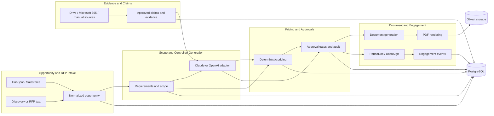
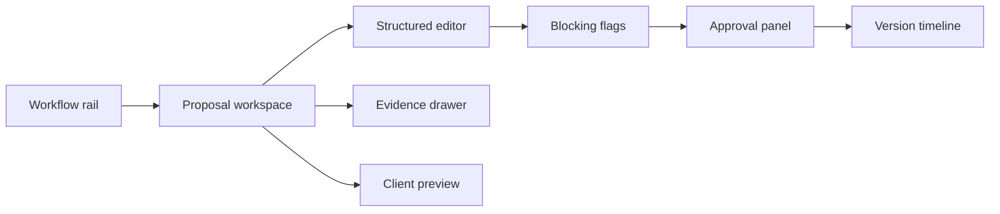

# AI Proposal, RFP and Quote Generation System

## Header

| Field | Value |
|---|---|
| Product | AI Proposal, RFP and Quote Generation System |
| One-line pitch | Produces controlled, priced, approval-ready proposals and RFP responses from CRM and discovery inputs for professional-services sales teams. |
| Status | Greenfield |
| Author | OpenCode |
| Date | 2026-08-04 |
| Timeline | 4 to 6 weeks |
| UI | Yes |
| Existing codebase | None; target directory was empty |
| Verified product source | `Project list.md`, section 6 only |
| MVP boundary | Listed stack and integrations only |

### Source discipline

- A product fact is verified only when stated in `Project list.md` section 6.
- Architecture, schemas, endpoint shapes, UI tokens, thresholds, sequencing, and implementation mechanics are `[inferred]`.
- Provider endpoint behavior, API versions, authentication details, rate limits, model versions, rendering benchmarks, and external citations are `[uncertain]` unless verified by the source.
- Team size, budget, external deadline, production credentials, customer data, and compliance certification are not assumed.

## Project Summary

Complex proposals take hours, require information from multiple systems, and directly influence deal velocity. The product converts CRM opportunities, discovery-call text, RFP inputs, approved content, and pricing rules into a controlled proposal or RFP response for agencies, consultancies, managed service providers, construction firms, manufacturers, software vendors, and government contractors.

The MVP is a visible workflow from import through evidence, scope, deterministic quote, approval, branded PDF, signature handoff, and engagement tracking where provider behavior supports it `[uncertain]`. AI drafts constrained structure and prose; it never becomes the authority for price, approval, or unsupported claims.

## Table of Contents

- [Header](#header)
- [Project Summary](#project-summary)
- [Table of Contents](#table-of-contents)
- [Product Overview](#product-overview)
- [Technology Stack](#technology-stack)
- [System Architecture](#system-architecture)
- [Core Design: Controlled Proposal Generation](#core-design-controlled-proposal-generation)
- [Design System](#design-system)
- [Build Plan](#build-plan)
- [Open Decisions & Future Scope](#open-decisions--future-scope)
- [Appendix: References](#appendix-references)

### Nested navigation

- [Product workflow](#product-workflow)
- [Failure modes](#failure-modes)
- [Success metrics](#success-metrics)
- [Canonical contracts](#canonical-contracts)
- [End-to-end traces](#end-to-end-traces)
- [Phase outputs](#phase-outputs)

## Product Overview

### Product promise

The system produces a branded proposal or RFP response containing a traceable opportunity and discovery context, structured deliverables and milestones, assumptions and optional services, deterministic pricing and payment schedule, evidence-backed claims, approval status, version history, and a client-facing document.

The workflow supports CRM import, discovery-call ingestion, a content library, approved claims, scope generation, pricing rules, optional items, internal approval, branded document export, e-signature, engagement tracking, reminders, and version history. These capabilities are source-verified; provider-specific behavior remains `[uncertain]`.

### Product workflow

| Stage | Input | Controlled output | Blocking gate |
|---|---|---|---|
| Capture | HubSpot/Salesforce opportunity, discovery text, or RFP text | Normalized opportunity and source records | Required fields valid |
| Ground | Approved content and source files | Candidate evidence and approved claims | Source and approval state valid |
| Scope | Requirements, services, deliverables, milestones, assumptions | Structured scope and options | No unresolved required scope fields |
| Price | Versioned rules, quantities, discounts, options | Quote and payment schedule | Deterministic calculation reconciles |
| Draft | Typed scope, quote, claims, and template | Reviewable proposal/RFP sections | Unsupported claims blocked |
| Approve | Draft, evidence, quote, and policy checks | Approval records and audit trail | Required gates complete |
| Deliver | Locked version and document template | Branded PDF and configured handoff | Version immutable and artifact ready |
| Observe | Provider events | Opens, views, signatures, reminders | Event accepted or visibly pending |

### Concrete failure modes

- CRM or discovery fields are missing, so the system creates a polished draft with an incomplete account, currency, requirement, or source context.
- Generic AI prose asserts a number, outcome, named client, certification, guarantee, or capability that has no approved evidence.
- A quote changes when a user reruns it because price was embedded in prose instead of calculated from a versioned rule.
- A client-facing version contains unreviewed claims, scope exceptions, or discounts because approval was implicit or bypassable.
- A later edit silently changes the version that was approved or delivered, making the artifact impossible to reconcile with its source and audit record.

### Roles and permissions

These are system roles, not personas.

| Role | MVP actions |
|---|---|
| Sales operator | Import opportunity, add discovery input, select content, configure scope, request draft, submit for approval |
| Content editor | Add/update content, attach evidence, set expiry, submit claims for approval |
| Quote approver | Review rules, quantities, options, discounts, assumptions, tax, and payment schedule; approve/reject |
| Proposal approver | Review claims, scope, document, and blocking flags; approve/reject |
| Client recipient | View delivered proposal, select allowed options, sign through configured provider `[uncertain]` |
| System administrator | Configure providers, templates, pricing rules, approval policy, and audit access `[inferred]` |

### MVP scope boundary

| Capability | Included | Deliberate limit |
|---|---|---|
| CRM | HubSpot and Salesforce import adapters | Normalize opportunity fields; write-back is `[inferred]` and not promised |
| Discovery | Notes, transcript text, or RFP text ingestion | Audio transcription is out of scope `[inferred]` |
| Content | Approved claims, evidence, case studies, templates | No unrestricted web retrieval |
| RFP | Ordered questions and answer drafting | No external bid-portal submission |
| Scope | Deliverables, milestones, assumptions, exclusions, options | No delivery-plan execution |
| Quote | Versioned rules, quantities, discounts, tax, options, payment schedule | No model-created prices |
| Documents | Branded proposal and RFP response PDF | Document-service behavior is `[uncertain]` |
| Signatures | PandaDoc and DocuSign adapter boundary | Envelope, webhook, and authentication details are `[uncertain]` |
| Payments | Stripe adapter boundary for payment-related proposal data | Payment links and confirmations are `[uncertain]` and not approval prerequisites |
| Sources | Google Drive and Microsoft 365 adapter boundary plus manual fallback | Permissions and delta-sync behavior are `[uncertain]` |
| Engagement | Opens, views, signatures, reminders when events exist | Event granularity is `[uncertain]` |

### Success metrics

Targets are product acceptance targets `[inferred]`, not externally verified benchmarks.

| ID | Metric | Measurement | Target |
|---|---|---|---|
| M1 | Draft traceability rate | Generated verifiable blocks with an approved claim/evidence path divided by all verifiable blocks | 100% |
| M2 | Unsupported-claim escape rate | Unsupported claims in a delivered version divided by delivered claims | 0% |
| M3 | Price reconciliation rate | Quotes where lines, discounts, tax, total, and schedule reconcile divided by valid quotes | 100% |
| M4 | Approval completeness rate | Delivered versions with all required approvals divided by delivered versions | 100% |
| M5 | Render success rate | Ready artifacts divided by valid render requests in fixture runs | >=99% |
| M6 | Required RFP resolution rate | Required RFP items with approved answers or approved exclusions before delivery | 100% |
| M7 | Locked-version mutation count | Locked or delivered versions changed in place | 0 |
| M8 | First-draft elapsed time | Time from valid generation request to draft in the demo path | <=15 minutes `[inferred]` |
| M9 | Provider adapter fixture coverage | Listed adapters exercised with success and failure fixtures | 100% |
| Q1 | Qualitative observable behavior: reviewer explanation | In a walkthrough, the reviewer traces each displayed claim, price, and approval decision to its source, rule, or audit record | Reviewer explains all three without an unexplained assertion `[inferred]` |

## Technology Stack

### Required stack

| Layer | Required technology/integration | Requirement-specific justification |
|---|---|---|
| Web UI | Next.js | The product has a UI and needs screens for opportunity import, editor, content, pricing, approval, client proposal, and engagement analytics. |
| API | FastAPI | Provides a typed server boundary for normalized proposal, quote, approval, and adapter contracts `[inferred]`. |
| Persistence | PostgreSQL | Stores opportunities, source records, claims, versions, quotes, approvals, artifacts, and audit events `[inferred]`. |
| AI | Claude or OpenAI | Source lists these model choices for controlled retrieval and structured document generation; exact model/version is `[uncertain]`. |
| Document generation | Document-generation services | Produces branded proposal/RFP documents from locked structured versions; provider is `[uncertain]`. |
| PDF | PDF rendering | Converts an approved document into the deliverable artifact required by the workflow. |
| Artifact storage | Object storage | Retains versioned PDFs and checksums while document metadata stays in PostgreSQL `[inferred]`. |
| CRM import | HubSpot and Salesforce | Supplies opportunity and discovery context to start the proposal workflow. |
| Signature handoff | PandaDoc and DocuSign | Supports the source-listed e-signature step through isolated adapters. |
| Payments | Stripe | Holds the source-listed payment-related integration boundary; live payment behavior is `[uncertain]`. |
| Source ingestion | Google Drive and Microsoft 365 | Supplies content-library source material and evidence records. |

### Stack constraints

- Do not add Redis, a queue, a search engine, an observability vendor, a second AI provider, or an unlisted external integration to the MVP boundary.
- Provider payloads are adapted into canonical types before entering claim, pricing, approval, or document logic `[inferred]`.
- Exact API versions, scopes, rate limits, webhook semantics, model context limits, document APIs, renderer behavior, and object-storage vendor are `[uncertain]`.
- Fixtures must exercise each listed provider boundary so the complete demo does not depend on unverified credentials `[inferred]`.

## System Architecture

### Bounded contexts



All boundaries and persistence relationships in this diagram are `[inferred]` from the verified stack, features, and integration list.

### Request-to-response communication flow

1. The Next.js UI sends a canonical request to FastAPI; it never calls provider APIs directly `[inferred]`.
2. FastAPI authenticates the workspace and role, then validates the request shape `[inferred]`.
3. The relevant adapter imports a HubSpot/Salesforce opportunity, Drive/Microsoft 365 source, or manual fixture and creates a `SourceRecord`.
4. PostgreSQL stores the normalized opportunity, source metadata, content status, and proposal working version `[inferred]`.
5. The scope service extracts editable requirements, assumptions, open questions, deliverables, milestones, options, and exclusions from supplied text.
6. The claims service filters only approved, unexpired claims and attaches evidence links; it does not approve discovery statements automatically.
7. The generation adapter receives the typed request and returns schema-validated sections, claim usage, and validation flags.
8. The pricing engine calculates quote lines and payment installments from rule IDs and integer minor units; it does not call the model.
9. The validation service blocks unsupported claims, price mismatches, unresolved required items, missing sources, and missing approvals.
10. Approvers review claim, scope, quote, and proposal gates; decisions append audit events.
11. A fully approved version is locked and passed to the document-generation/PDF boundary; the artifact is stored with a checksum.
12. The configured signature or payment adapter receives a canonical delivery request; provider responses and engagement events are stored without mutating the locked version `[inferred]`.
13. FastAPI returns the current status, artifact metadata, blocking flags, and provider result to the UI.

### Proposed directory tree

This is implementation guidance for the greenfield project, not existing codebase context `[inferred]`.

```text
app/                                      # application root [inferred]
  web/                                    # Next.js UI routes and components [inferred]
    app/page.tsx                          # workflow entry screen [inferred]
    app/opportunities/page.tsx            # CRM opportunity import list [inferred]
    app/proposals/[id]/page.tsx           # proposal workspace [inferred]
    app/content/page.tsx                  # approved claims and evidence library [inferred]
    app/analytics/page.tsx                # engagement event view [inferred]
  api/                                    # FastAPI HTTP boundary [inferred]
    main.py                               # API application bootstrap [inferred]
    routes/proposals.py                   # proposal and version endpoints [inferred]
    routes/quotes.py                      # deterministic quote endpoints [inferred]
    routes/approvals.py                   # approval decision endpoints [inferred]
  domain/                                 # canonical business contracts [inferred]
    schemas.py                            # typed request and response models [inferred]
    claims.py                             # approved-claim validation [inferred]
    pricing.py                            # integer minor-unit calculation [inferred]
    workflow.py                            # proposal state transitions [inferred]
  adapters/                               # provider isolation layer [inferred]
    crm.py                                # HubSpot and Salesforce mapping [inferred]
    sources.py                            # Drive and Microsoft 365 mapping [inferred]
    documents.py                          # document-generation and PDF boundary [inferred]
    signatures.py                         # PandaDoc and DocuSign boundary [inferred]
    payments.py                            # Stripe boundary [inferred]
  persistence/                            # PostgreSQL repositories [inferred]
    models.py                             # stored domain records [inferred]
    repositories.py                       # aggregate persistence operations [inferred]
  fixtures/                               # explicit demo provider payloads [inferred]
    agency_discovery.json                 # source demo scenario fixture [inferred]
    rfp_response.json                     # controlled RFP trace fixture [inferred]
  tests/                                  # repeatable contract and trace tests [inferred]
    test_pricing.py                       # pricing invariant tests [inferred]
    test_claims.py                        # unsupported-claim tests [inferred]
    test_traces.py                        # end-to-end trace tests [inferred]
```

### Access and artifact rules

- Provider credentials stay outside proposal content and are never rendered.
- Source excerpts and metadata are retained only as needed to explain generated claims `[inferred]`.
- Audit metadata redacts tokens and secrets `[inferred]`.
- Workspace and role checks protect source records, approval actions, and artifacts `[inferred]`.
- Retention, encryption, regional hosting, and compliance obligations are `[uncertain]` and are not product promises.

## Core Design: Controlled Proposal Generation

### Design invariants

| ID | Invariant |
|---|---|
| I1 | Every client-facing claim is a template literal or references approved claims and evidence links. |
| I2 | Every quote line references one pricing-rule version. |
| I3 | `totalMinor = subtotalMinor - discountMinor + taxMinor`. |
| I4 | Optional lines affect totals only when selected. |
| I5 | Locked versions cannot change scope, claims, sources, quote, approvals, or rendered content. |
| I6 | Delivery requires a ready document and every required approval. |
| I7 | Expired or rejected claims cannot be used in a new version. |
| I8 | Missing source, unresolved requirement, failed validation, or pending required approval blocks delivery. |
| I9 | Money uses integer minor units; floating point pricing is prohibited. |
| I10 | Provider events append engagement records and cannot mutate a locked version. |

### State model

| Aggregate | States |
|---|---|
| Opportunity | `imported -> normalized -> ready` or `needs_attention` |
| Proposal | `assembling -> draft -> in_review -> approved -> delivered` or `rejected` or `archived` |
| ProposalVersion | `working -> submitted -> locked -> rendered -> delivered` |
| ContentItem | `draft -> pending_approval -> approved` or `expired` or `rejected` |
| Quote | `calculated -> review_required -> approved` or `rejected` or `superseded` |
| Approval | `pending -> approved` or `rejected` |
| Document | `requested -> rendering -> ready` or `failed` |

These state names are implementation contracts `[inferred]`.

### Canonical contracts

```ts
type UUID = string;
type ISODateTime = string;
type MinorUnits = number;
type CurrencyCode = string;
type Provider = "hubspot" | "salesforce" | "pandadoc" | "docusign" | "stripe" | "google_drive" | "microsoft_365" | "manual";
type SourceRecord = { id: UUID; provider: Provider; externalId?: string; title: string; uri?: string; retrievedAt: ISODateTime; contentHash: string; excerpt?: string; sourceType: "crm" | "discovery" | "content" | "rfp" | "manual"; approvedForGeneration: boolean };
type Opportunity = { id: UUID; externalProvider?: Provider; externalId?: string; accountName: string; contactName?: string; title: string; currency: CurrencyCode; status: "imported" | "normalized" | "needs_attention"; sourceRecordIds: UUID[]; requiredFieldErrors: string[]; importedAt: ISODateTime };
type DiscoveryInput = { id: UUID; opportunityId: UUID; kind: "notes" | "transcript" | "rfp_text"; text: string; sourceRecordId: UUID; extractedAt: ISODateTime };
type Requirement = { id: UUID; text: string; sourceRecordIds: UUID[]; status: "confirmed" | "assumption" | "open_question"; confidence: "high" | "medium" | "low" };
type Deliverable = { id: UUID; name: string; description: string; quantity: number; unit: string; milestoneIds: UUID[]; sourceRecordIds: UUID[]; optional: boolean };
type Milestone = { id: UUID; name: string; sequence: number; targetDescription: string; sourceRecordIds: UUID[] };
type Assumption = { id: UUID; text: string; sourceRecordIds: UUID[]; customerConfirmationRequired: boolean };
type Scope = { deliverables: Deliverable[]; milestones: Milestone[]; assumptions: Assumption[]; exclusions: string[]; openQuestions: string[] };
type Claim = { id: UUID; text: string; status: "draft" | "pending_approval" | "approved" | "expired" | "rejected"; sourceRecordIds: UUID[]; validFrom?: string; validUntil?: string; allowedContexts: string[]; prohibitedContexts: string[] };
type EvidenceLink = { claimId: UUID; sourceRecordId: UUID; locator: string; excerpt: string; verifiedBy?: UUID; verifiedAt?: ISODateTime };
type QuoteLine = { id: UUID; label: string; ruleId: UUID; quantity: number; unitPriceMinor: MinorUnits; subtotalMinor: MinorUnits; optional: boolean; selected: boolean; sourceRecordIds: UUID[] };
type PaymentInstallment = { sequence: number; label: string; amountMinor: MinorUnits; dueDescription: string };
type Quote = { currency: CurrencyCode; lines: QuoteLine[]; subtotalMinor: MinorUnits; discountMinor: MinorUnits; taxMinor: MinorUnits; totalMinor: MinorUnits; paymentSchedule: PaymentInstallment[]; pricingRuleVersion: string; inputHash: string; calculatedAt: ISODateTime };
type Approval = { id: UUID; proposalVersionId: UUID; kind: "claim" | "scope" | "quote" | "proposal"; requiredRole: "content_editor" | "quote_approver" | "proposal_approver"; decision: "pending" | "approved" | "rejected"; reviewerId?: UUID; comment?: string; decidedAt?: ISODateTime };
type ProposalVersion = { id: UUID; proposalId: UUID; versionNumber: number; status: "working" | "submitted" | "locked" | "rendered" | "delivered"; title: string; scope: Scope; quote: Quote; claimIds: UUID[]; sourceRecordIds: UUID[]; unresolvedFlags: string[]; createdAt: ISODateTime; lockedAt?: ISODateTime };
```

### Generation interfaces

```ts
interface GenerateDraftRequest {
  proposalVersionId: UUID;
  opportunity: Opportunity;
  discovery: DiscoveryInput[];
  requirements: Requirement[];
  scope: Scope;
  approvedClaims: Array<Claim & { evidence: EvidenceLink[] }>;
  templateId: UUID;
  requestedSections: Array<"executive_summary" | "understanding" | "scope" | "milestones" | "assumptions" | "options" | "pricing" | "payment_schedule" | "case_studies" | "next_steps" | "rfp_answers">;
  modelProvider: "claude" | "openai";
  modelName: string;
}
interface GeneratedBlock { blockId: UUID; kind: "text" | "table" | "list" | "quote"; content: string; claimIds: UUID[]; sourceRecordIds: UUID[]; editable: boolean; }
interface GeneratedSection { key: string; blocks: GeneratedBlock[]; }
interface ClaimUsage { claimId: UUID; blockId: UUID; evidenceLinkIds: UUID[]; validation: "approved" | "blocked"; }
interface ValidationFlag { code: "MISSING_SOURCE" | "UNAPPROVED_CLAIM" | "EXPIRED_CLAIM" | "UNRESOLVED_REQUIREMENT" | "PRICE_MISMATCH" | "MISSING_APPROVAL" | "SCHEMA_ERROR" | "RENDER_ERROR"; severity: "blocking" | "warning"; message: string; relatedIds: UUID[]; }
interface GenerateDraftResponse { proposalVersionId: UUID; sections: GeneratedSection[]; claimsUsed: ClaimUsage[]; unresolvedFlags: ValidationFlag[]; generationRunId: UUID; sourceSnapshotHash: string; }
```

The model name is recorded for audit; available model versions and behavior are `[uncertain]`. Schema validation rejects malformed or extra fields before persistence `[inferred]`.

### Source tracking and approved claims

| Rule | Required behavior |
|---|---|
| Source identity | Every imported or manual source has provider, external ID when available, title, URI when available, retrieval time, content hash, type, and approval flag. |
| Claim approval | A reusable claim requires evidence excerpt, locator, allowed context, optional expiry, verifier, and approval decision. |
| Discovery separation | A discovery statement can become a requirement or assumption but cannot become proof automatically. |
| Claim expiry | Expired or rejected claims are excluded from generation and cause dependent blocks to fail validation. |
| Version snapshot | A proposal version stores source IDs, claim versions, pricing-rule versions, template ID, and generated output. |
| Conflict handling | Conflicting claims or changed evidence produce a visible review flag `[inferred]`. |

### Unsupported-claim prevention

| Detected condition | System action |
|---|---|
| Company-specific fact without approved claim | Block the block with `MISSING_SOURCE`. |
| Number, percentage, date, guarantee, certification, named client, or outcome without matching evidence | Block or convert to a clearly labeled assumption. |
| Unconfigured provider capability in prose | Block and expose the capability as `[uncertain]`. |
| Conflict with approved claim | Block until a reviewer resolves the conflict. |
| Human edit changes a supported claim | Re-run validation before submission. |
| Model returns an unsupported assertion | Do not persist the block; return `UNAPPROVED_CLAIM`. |

```python
def validate_block(block, claims_by_id, evidence_by_claim, now):
    flags = []
    for claim_id in block.claim_ids:
        claim = claims_by_id.get(claim_id)
        if claim is None:
            flags.append("MISSING_SOURCE")
            continue
        if claim.status != "approved":
            flags.append("UNAPPROVED_CLAIM")
        if claim.valid_until and claim.valid_until < now:
            flags.append("EXPIRED_CLAIM")
        if not evidence_by_claim.get(claim_id):
            flags.append("MISSING_SOURCE")
    if contains_verifiable_assertion(block.content) and not block.claim_ids:
        flags.append("UNAPPROVED_CLAIM")
    return flags
```

### Deterministic pricing

```ts
interface PricingRule { id: UUID; version: string; label: string; unit: string; currency: CurrencyCode; unitPriceMinor: MinorUnits; minQuantity: number; maxQuantity?: number; optional: boolean; activeFrom: string; activeUntil?: string; discountPolicyId?: UUID; sourceRecordIds: UUID[]; }
interface DiscountPolicy { id: UUID; version: string; maxPercentWithoutApproval: number; maxMinorWithoutApproval: MinorUnits; requiresQuoteApprovalAbove: number; }
```

1. Validate one currency for the quote and every selected rule.
2. Validate quantity bounds and active dates.
3. Calculate each selected line as `quantity * unitPriceMinor`.
4. Sum selected lines into `subtotalMinor`.
5. Apply explicit `discountMinor` and explicit tax input or versioned tax rule.
6. Compute `totalMinor = subtotalMinor - discountMinor + taxMinor` and reject negative totals.
7. Validate payment installments sum exactly to `totalMinor`.
8. Persist rule versions, inputs, output, and `inputHash`.

The model may suggest quantities or packages, but only this engine computes money. Missing currency, mixed currencies, inactive rules, out-of-range quantity, price without a rule, negative total, schedule mismatch, and policy-exceeding discount are blocking conditions.

### Approval and version contracts

| Gate | Required before | Evidence reviewed |
|---|---|---|
| Content | Claim is reusable | Text, context, evidence excerpt, expiry |
| Scope | Proposal submission | Requirements, deliverables, milestones, assumptions, exclusions |
| Quote | Proposal approval when required | Rule versions, quantities, options, discounts, tax, schedule |
| Proposal | Rendering and delivery | Complete draft, resolved flags, prior decisions |

- Rejection requires a comment; approval stores reviewer, role, timestamp, and decision `[inferred]`.
- Every edit to a submitted or locked version creates a new working version.
- A locked version is the only input accepted by rendering and delivery.
- A final artifact is addressed by proposal-version ID and checksum `[inferred]`.
- Provider events append to the audit/engagement stream and cannot rewrite history.

```ts
interface AuditEvent { id: UUID; workspaceId: UUID; actorType: "user" | "system" | "provider"; actorId?: UUID; action: "imported" | "edited" | "generated" | "validated" | "approved" | "rejected" | "locked" | "rendered" | "delivered" | "engagement_received"; entityType: "opportunity" | "content" | "claim" | "proposal" | "quote" | "document"; entityId: UUID; beforeHash?: string; afterHash?: string; metadata: Record<string, string>; createdAt: ISODateTime; }
interface AdapterFailure { code: "AUTH" | "NOT_FOUND" | "RATE_LIMIT" | "UNSUPPORTED" | "TEMPORARY" | "UNKNOWN"; provider: Provider; message: string; retryable: boolean; externalRequestId?: string; }
interface ProviderAdapter<TRequest, TResponse> { provider: Provider; capabilities(): string[]; execute(request: TRequest): Promise<TResponse | AdapterFailure>; }
```

### API contract surface

| Method and path | Request | Success output |
|---|---|---|
| `POST /v1/opportunities/import` | `{ provider, externalId }` | `{ opportunity, blockingErrors }` |
| `POST /v1/proposals` | `{ opportunityId, templateId, discoveryInputIds, sourceRecordIds }` | `{ proposalId, workingVersionId, status, blockingFlags }` |
| `POST /v1/proposal-versions/{id}/generate` | `{ requestedSections, modelProvider, modelName }` | `{ proposalVersionId, generationRunId, unresolvedFlags, sourceSnapshotHash }` |
| `POST /v1/proposal-versions/{id}/quote/calculate` | `{ currency, lines, discountMinor, taxMinor, paymentSchedule }` | `{ quote, blockingFlags }` |
| `POST /v1/proposal-versions/{id}/validate` | no body | `{ versionId, blockingFlags }` |
| `POST /v1/proposal-versions/{id}/submit` | no body | `{ versionId, status, requiredApprovals }` |
| `POST /v1/approvals/{id}/decide` | `{ decision, comment }` | `{ approvalId, decision, auditEventId }` |
| `POST /v1/proposal-versions/{id}/render` | no body | `{ documentId, status, artifactObjectKey, checksum }` |
| `POST /v1/proposal-versions/{id}/deliver` | `{ provider }` | `{ documentId, providerDelivery }` |

```json
POST /v1/proposal-versions/{id}/quote/calculate
{"currency":"USD","lines":[{"ruleId":"uuid","quantity":1,"selected":true},{"ruleId":"uuid","quantity":1,"selected":false}],"discountMinor":0,"taxMinor":0,"paymentSchedule":[{"sequence":1,"label":"Kickoff","amountMinor":500000,"dueDescription":"At kickoff"}]}

200
{"quote":{"currency":"USD","subtotalMinor":500000,"discountMinor":0,"taxMinor":0,"totalMinor":500000,"pricingRuleVersion":"2026-08-04.1","inputHash":"sha256:..."},"blockingFlags":[]}
```

### End-to-end traces

#### Trace A: agency discovery call to approved proposal

Real input is the source-listed agency discovery-call scenario. The input is a CRM opportunity plus discovery transcript text; the output is a scoped proposal with deliverables, milestones, optional services, payment schedule, supporting case studies, branded PDF, and approval state.

```ts
type TraceAInput = { crm: { provider: "hubspot" | "salesforce"; externalId: string }; discovery: DiscoveryInput; selectedRuleIds: UUID[]; approvedClaimIds: UUID[] };
type TraceAOutput = { version: ProposalVersion; quote: Quote; document: { objectKey: string; checksum: string }; approvals: Approval[]; engagementStatus: "pending" | "available" };
```

| Step | Input to next boundary | Output/control |
|---|---|---|
| 1 | CRM opportunity | Normalized opportunity, currency, and CRM source record |
| 2 | Discovery transcript | Requirements, assumptions, open questions, and discovery source record |
| 3 | Scope selections | Deliverables, milestones, exclusions, optional services |
| 4 | Approved case-study claims | Evidence-backed claim set; expired claims blocked |
| 5 | Selected pricing rules | Reconciled quote and payment schedule in integer minor units |
| 6 | Typed scope, quote, claims, and template | Draft sections with claim usage and source IDs |
| 7 | Manual edits | Working version with attributed changes `[inferred]` |
| 8 | Claim, scope, quote, and proposal review | Required approvals or rejection comments |
| 9 | Locked approved version | Branded PDF in object storage with checksum |
| 10 | Signature/delivery adapter | Delivery and engagement status; provider behavior `[uncertain]` |

Failure handling: missing CRM field becomes `needs_attention`; unmapped requirement becomes an open-question block; expired case study is removed or replaced; discount exception requires quote approval; invented outcome is blocked; render failure leaves the version undelivered.

#### Trace B: RFP response with controlled quote

Real input is an RFP text/file plus a CRM opportunity. The output is an ordered, source-linked response with approved answers, structured scope, deterministic quote, approvals, and branded PDF.

```ts
type TraceBInput = { rfp: { itemId: string; question: string; sourceLocator: string }[]; opportunity: Opportunity; approvedClaims: Array<Claim & { evidence: EvidenceLink[] }> };
type TraceBOutput = { answers: Array<{ itemId: string; text: string; claimIds: UUID[]; unresolved: boolean }>; quote: Quote; lockedVersionId: UUID; pdfObjectKey: string };
```

| Step | Input to next boundary | Output/control |
|---|---|---|
| 1 | RFP text or file | Ordered RFP items and preserved locators |
| 2 | RFP items plus opportunity | Version with RFP context and linked sources |
| 3 | Approved claims and excerpts | Candidate answers with claim usage |
| 4 | Candidate answers | Unsupported or unanswered items become blocking flags |
| 5 | Response edits | Working answer-to-question mapping |
| 6 | Requirements and answers | Scope, assumptions, exclusions, and open questions |
| 7 | Pricing rules and options | Deterministic quote and reconciled schedule |
| 8 | Quote and full response | Quote/proposal approvals or rejection comments |
| 9 | Locked response | Branded PDF with version and source metadata |
| 10 | PandaDoc/DocuSign adapter | Delivery result and engagement timeline; behavior `[uncertain]` |

Failure handling: unsupported answer is blocked; scope conflict requires an explicit assumption/exclusion decision; currency mismatch blocks quote; unavailable signature provider leaves the approved PDF available without mutating content.

## Design System

### Principles

| Principle | UI behavior |
|---|---|
| Evidence before fluency | Client-facing claims expose a source indicator and open an evidence drawer. |
| Price is inspectable | Quote lines, options, discount, tax, total, and schedule stay visible together. |
| Blocking is actionable | Every block names its flag code and links to the field, claim, or approval that resolves it. |
| Approval is visible | Gate, role, reviewer, timestamp, comment, and remaining dependencies are explicit. |
| Version means truth | Working, submitted, locked, rendered, and delivered states are distinct. |
| Client view is clean | Internal sources and audit metadata stay outside the client-facing preview. |

### Information architecture

| Route | Purpose | Primary action |
|---|---|---|
| `/opportunities` | Imported CRM opportunities | Import or open |
| `/opportunities/:id` | Opportunity and discovery context | Start proposal |
| `/proposals/:id` | Proposal workspace and versions | Continue workflow |
| `/proposals/:id/scope` | Requirements and scope | Confirm scope |
| `/proposals/:id/quote` | Pricing configurator | Recalculate/request quote approval |
| `/proposals/:id/content` | Claims and evidence | Resolve evidence flags |
| `/proposals/:id/approval` | Approval gates and audit | Approve/reject |
| `/proposals/:id/preview` | Client proposal | Render/deliver |
| `/content` | Content library | Add/review content |
| `/analytics` | Engagement events | Inspect events |

### Color tokens

Token choices are visual implementation guidance `[inferred]`.

```css
:root {
  --ink-950: #17212b; /* primary copy and high-contrast headings */
  --ink-700: #40505f; /* secondary copy and table labels */
  --ink-500: #6f7d8a; /* muted metadata and timestamps */
  --paper: #fbfaf7; /* warm application background */
  --panel: #ffffff; /* editor, card, and preview surfaces */
  --line: #d9dedf; /* input, table, and panel boundaries */
  --teal-700: #0f5d5e; /* primary actions and approved states */
  --teal-100: #dff2ef; /* approved-state background */
  --amber-700: #9a5b00; /* warning and review-required text */
  --amber-100: #fff0ce; /* warning background */
  --red-700: #a12a31; /* blocking and rejected text */
  --red-100: #fbe3e3; /* blocking background */
  --radius-sm: 6px; /* compact controls */
  --radius-md: 10px; /* cards and drawers */
  --shadow-card: 0 8px 24px rgba(23, 33, 43, 0.08); /* depth for active work surfaces */
}
```

### Typography scale

| Token | Size/leading | Use |
|---|---|---|
| Display | 32/38 | Proposal title and primary client preview heading |
| H1 | 24/30 | Workspace page heading |
| H2 | 18/24 | Section and approval gate heading |
| Body | 15/22 | Proposal editor and evidence text |
| Label | 13/18 | Form labels, table headers, status chips |
| Caption | 12/16 | Source locator, hash, timestamp, provider metadata |

Use a system sans stack `[inferred]`; client proposal body copy should use the selected template's configured typography.

### Layout diagram



Desktop may show rail, editor, evidence, and preview concurrently; narrow screens stack evidence, editor, preview, then approvals `[inferred]`.

### Micro-interactions

| Interaction | Trigger | Feedback |
|---|---|---|
| Import | Provider or fixture selected | Normalize fields, show source badge, then surface missing-field blocks. |
| Generate | Valid scope and evidence submitted | Show generation status, then reveal section-level claim/source indicators. |
| Evidence inspect | Source badge clicked | Open excerpt, locator, hash, approval, verifier, and expiry. |
| Option toggle | Optional line selected | Recalculate totals immediately and mark quote as changed. |
| Quote exception | Discount crosses policy | Amber review state and quote-approval action appear. |
| Manual claim edit | Supported block edited | Re-run validation and show block/approved result before submission. |
| Approval | Approve or reject clicked | Require comment on rejection and append audit event. |
| Lock | All gates complete | Disable editing, create snapshot hash, and enable render. |
| Render | Locked version submitted | Show rendering status, then artifact checksum or actionable failure. |
| Provider failure | Adapter returns failure | Show provider, code, retryability, and preserve canonical version. |

### Screen acceptance

| Screen | Required visible content |
|---|---|
| Opportunity import | CRM source, normalized fields, source record, missing-field warning |
| Proposal editor | Draft sections, source indicators, unresolved flags, version status |
| Content library | Approved claims, evidence excerpts, expiry, status filter |
| Pricing configurator | Rules, quantities, options, deterministic totals, discount gate, schedule |
| Approval page | Separate gate decisions, rejection comments, audit trail, final block state |
| Client proposal | Brand, scope, timeline, assumptions, options, price, schedule, signatures |
| Engagement analytics | Version and delivered/open/view/signature/reminder event or unavailable state |

## Build Plan

The plan is five weeks, inside the source-verified 4 to 6 week build-time boundary. Staffing and budget are unspecified and are not inferred.

### Phase 1: Foundation and intake (Week 1)

- [ ] Create the Next.js UI shell and FastAPI boundary `[inferred]`.
- [ ] Define PostgreSQL records for workspace, source, opportunity, proposal, version, and audit `[inferred]`.
- [ ] Implement HubSpot and Salesforce adapter contracts with explicit fixtures.
- [ ] Store discovery notes, transcript text, and RFP text as source-linked inputs.
- [ ] Add the first role/action checks `[inferred]`.

**Demoable output:** Import either CRM fixture, reopen the normalized opportunity, and see source-linked discovery text with missing-field blocks.

### Phase 2: Evidence, scope, and claims (Week 2)

- [ ] Implement content items, evidence links, approved claims, expiry, rejection, and version history.
- [ ] Add manual, Google Drive, and Microsoft 365 source adapter boundaries with fixture states `[inferred]`.
- [ ] Turn discovery input into editable requirements, assumptions, and open questions.
- [ ] Implement unsupported-claim and expired-claim blocking.
- [ ] Build the proposal editor and evidence drawer.

**Demoable output:** Create an approved case-study claim, attach an excerpt, and show an unsupported claim blocked in the proposal editor.

### Phase 3: Scope, pricing, and generation (Week 3)

- [ ] Build deliverable, milestone, assumption, exclusion, and optional-service editing.
- [ ] Implement versioned pricing rules using integer minor units.
- [ ] Add discount-policy threshold and quote-approval generation.
- [ ] Implement the Claude/OpenAI typed generation adapter boundary `[inferred]`.
- [ ] Insert approved supporting claims with source tracking.

**Demoable output:** Assemble the agency scope, toggle an optional service, recalculate a reconciled quote and payment schedule, and generate typed draft sections.

### Phase 4: Approval, document, and delivery (Week 4)

- [ ] Implement claim, scope, quote, and proposal approval gates.
- [ ] Require rejection comments and append audit events.
- [ ] Lock approved versions and create immutable source/rule/template snapshots.
- [ ] Pass locked versions through document generation and PDF rendering.
- [ ] Store artifact object key, version ID, and checksum; exercise PandaDoc and DocuSign fixtures `[inferred]`.

**Demoable output:** Approve the generated agency proposal, render a branded PDF, and show that a post-lock edit creates a new version instead of changing the artifact.

### Phase 5: RFP, engagement, and acceptance (Week 5)

- [ ] Import ordered RFP items with original question and source locator.
- [ ] Map answers to approved claims and block unresolved required questions.
- [ ] Exercise Stripe payment-related adapter boundary without making payment confirmation an approval prerequisite `[uncertain]`.
- [ ] Record open/view/signature/reminder events or visible unavailable states.
- [ ] Run both end-to-end traces and all listed provider success/failure fixtures `[inferred]`.

**Demoable output:** Complete the RFP trace from text to approved response PDF, then show engagement events and provider failure recovery without document mutation.

### Completion gates

- [ ] No delivered claim lacks an approved evidence path.
- [ ] Repeated quote calculations reconcile identically for identical inputs.
- [ ] Approval cannot be bypassed and locked versions cannot be edited in place.
- [ ] Every PDF is tied to a proposal version and checksum.
- [ ] Both traces complete with their blocking and recovery branches.
- [ ] UI works on desktop and narrow screens within the listed screen scope `[inferred]`.

## Open Decisions & Future Scope

### Open decisions

| Decision | Recommendation | Reason |
|---|---|---|
| Exact model version | Keep provider/model name configurable and record it per generation run `[uncertain]` | Source names Claude or OpenAI but does not verify versions or limits. |
| Live provider authentication | Implement adapter contracts and fixtures first; verify scopes during integration `[uncertain]` | Credentials, scopes, endpoints, and webhooks are not in the source. |
| Document-generation vendor | Hide the vendor behind the locked-version document contract `[uncertain]` | Source requires document-generation services but names no vendor. |
| PDF renderer | Select one renderer in Phase 4 and test template fidelity `[uncertain]` | Rendering behavior and benchmark are unverified. |
| Payment behavior | Treat Stripe data as a payment schedule boundary until link/confirmation behavior is verified `[uncertain]` | The source lists Stripe but does not specify payment operations. |
| Source synchronization | Start with explicit import/manual fallback; add delta synchronization only after provider verification `[uncertain]` | Permissions and sync semantics are unverified. |
| Tax calculation | Require explicit tax input or a configured rule; never infer jurisdiction | Jurisdiction and tax behavior are not specified. |
| Approval configuration | Ship four available gates: content, scope, quote, proposal `[inferred]` | These gates directly protect approved claims, scope, price, and delivery. |
| Artifact access | Keep object keys in PostgreSQL and authorize retrieval by workspace/role `[inferred]` | The stack includes object storage but not access semantics. |

### Aggressive out-of-scope decisions

- **Full CRM replacement:** deferred because the source requires CRM import, not opportunity management or CRM parity.
- **Autonomous negotiation or term acceptance:** deferred because proposals need human approval and the source does not authorize autonomous commercial decisions.
- **Free-form AI pricing:** deferred because controlled, deterministic pricing is the agency-quality requirement.
- **Unrestricted web retrieval:** deferred because approved content and traceable evidence are the source-backed control boundary.
- **Audio transcription:** deferred because discovery-call ingestion is required, but transcription capability is not verified in the source.
- **External bid-portal submission:** deferred because RFP response generation is required, not portal automation.
- **Project delivery management:** deferred because the product ends at proposal/RFP delivery and engagement tracking.
- **Invoice collection and reconciliation:** deferred because Stripe is listed as an integration, but payment operations are `[uncertain]`.
- **Unlisted integrations or a mobile-native app:** deferred because the MVP boundary is the listed stack/integration set and a UI, not additional platform surfaces.
- **Compliance certification claims:** deferred because no certification, retention obligation, or jurisdiction is verified.

## Appendix: References

### Verified reference

| Reference | Specific takeaway used in this PRD |
|---|---|
| `Project list.md` §6 | Product name, advanced 4 to 6 week build time, and professional-services buyer categories. |
| `Project list.md` §6 | Complex proposals take hours, use multiple systems, and influence deal velocity. |
| `Project list.md` §6 | CRM import, discovery ingestion, content library, approved claims, scope, pricing rules, options, approvals, branded export, e-signature, engagement tracking, reminders, and version history are required product capabilities. |
| `Project list.md` §6 | Claude or OpenAI, controlled retrieval, structured generation, pricing validation, and hallucination checks define the AI direction. |
| `Project list.md` §6 | Next.js, FastAPI, PostgreSQL, document-generation services, PDF rendering, and object storage define the stack boundary. |
| `Project list.md` §6 | HubSpot, Salesforce, PandaDoc, DocuSign, Stripe, Google Drive, and Microsoft 365 define the integration boundary. |
| `Project list.md` §6 | Premium presentation includes pricing choices, timeline, assumptions, signatures, approval status, and analytics. |
| `Project list.md` §6 | Portfolio assets include opportunity import, proposal editor, content library, pricing configurator, approval page, client proposal, and engagement analytics. |
| `Project list.md` §6 | The demo is an agency discovery call producing deliverables, milestones, optional services, payment schedule, and supporting case studies. |
| `Project list.md` §6 | Agency-quality means approved language, deterministic pricing, source tracking, approvals, unsupported-claim prevention, and the whole sales workflow. |

### Uncertainty register

| Topic | Treatment |
|---|---|
| Team size, budget, external deadline | Not specified; no assumption added. |
| API versions, provider scopes, auth, webhooks, limits | `[uncertain]`; isolate behind adapters and fixtures. |
| Model versions and benchmarks | `[uncertain]`; record configured model name and measure only the acceptance targets. |
| Renderer, document vendor, object-storage vendor | `[uncertain]`; use internal contracts and verify during the relevant phase. |
| Tax, retention, encryption, region, compliance | `[uncertain]`; require explicit configuration and make no certification claim. |

### Product completion statement

The MVP is complete when the controlled evidence path, deterministic price, explicit approvals, immutable version, branded output, and both real-input-to-output traces work together without presenting unverified provider behavior as a product promise.
