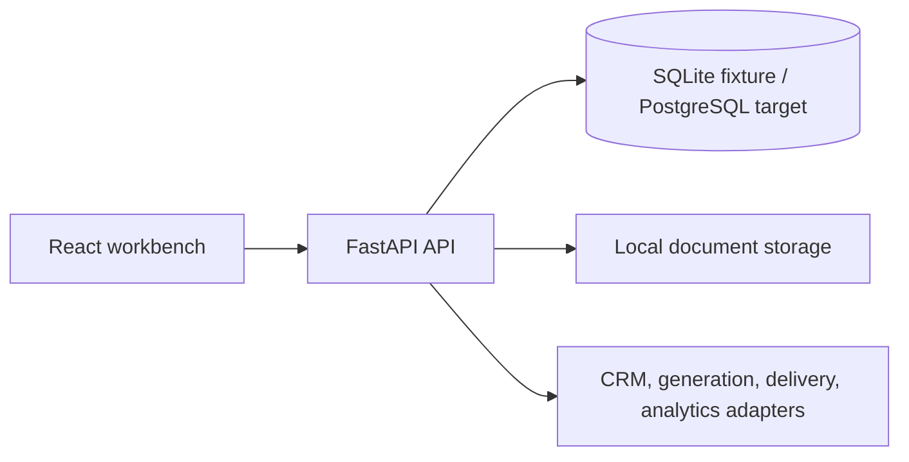

# Proposal Workflow System

Source-linked proposal and quote workflow for turning CRM/RFP material into an evidence-backed proposal, rule-backed pricing, role-gated approvals, rendered PDF delivery, and post-send engagement analytics.

## Project status

The default path is a deterministic fixture showcase. It needs no provider credentials and preserves the contracts used by live adapters. Authentication, tenant provisioning, migrations, live providers, durable document storage, and production deployment are not included in the fixture boundary.

## Architecture



## Included capabilities

- Opportunity import and source normalization.
- Evidence-linked proposal drafting and scope management.
- Server-shaped quote lines, options, policy review, and payment schedules.
- Role-gated approval and immutable locking behavior.
- PDF preview/download, delivery status, and engagement analytics.
- Deterministic adapter failures and fixture browser coverage.

## Quick start

Prerequisites: Python 3.11+, [`uv`](https://docs.astral.sh/uv/), Node.js/npm, and PowerShell.

```powershell
uv sync
npm --prefix app/web ci
.\start-dev.ps1
```

The launcher resets the disposable SQLite fixture and starts the API at `http://127.0.0.1:8106` and the web workbench at `http://127.0.0.1:3106`.

## Verification

```powershell
uv run pytest -q
uv run ruff check app/
npm --prefix app/web run build
npm --prefix app/web run e2e
```

## Project structure

```text
app/api/         FastAPI routes, authorization boundary, and health checks
app/persistence/ SQLite/PostgreSQL repository contracts and models
app/web/         Proposal workbench and browser tests
app/providers/   CRM, generation, delivery, and analytics adapters
docs/            Demo runbook and supporting handoff material
tests/           API, workflow, security, and browser verification
```

## Demo workflow

The primary screens are opportunities, proposal evidence, scope, quote, approval, preview, content, and analytics. Follow [`docs/DEMO_RUNBOOK.md`](docs/DEMO_RUNBOOK.md) for the click-by-click walkthrough and fallback procedure.

## Configuration and safety

Fixture mode uses SQLite and local document storage. Keep `ANTHROPIC_API_KEY`, CRM credentials, delivery credentials, and admin credentials in server-side environment or secret-manager contexts. Never commit `.env`, generated documents, or provider secrets. The fixture reset is disposable-only behavior.

## Production boundary

Before live use, implement authenticated actors, workspace-level authorization, database migrations, durable object storage, transactional provider operations, idempotency, audit persistence, retention/deletion, backups, observability, and recovery tests. A fixture PDF or browser pass does not establish production readiness.
